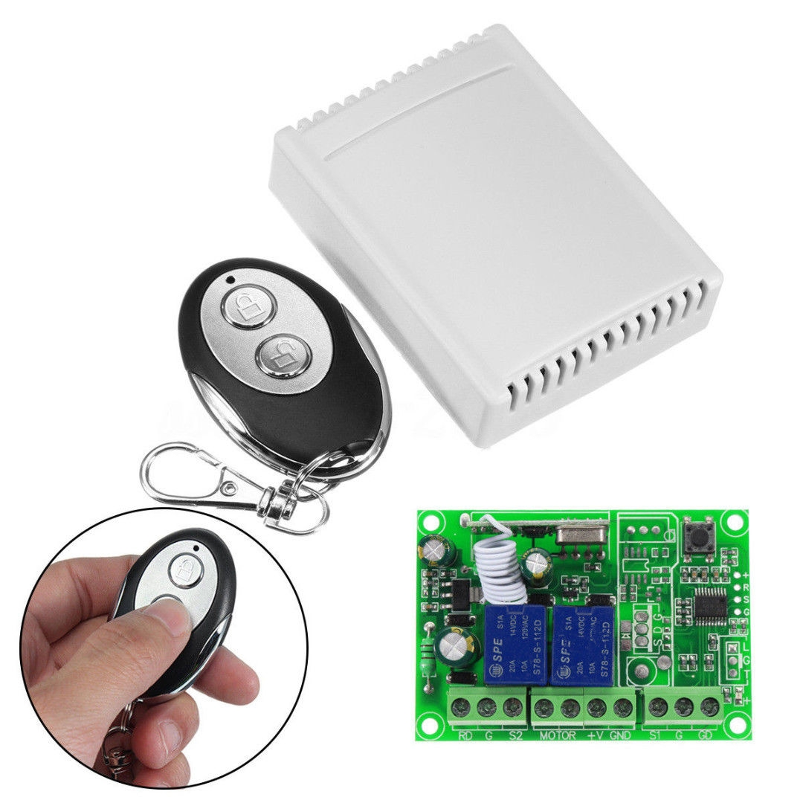
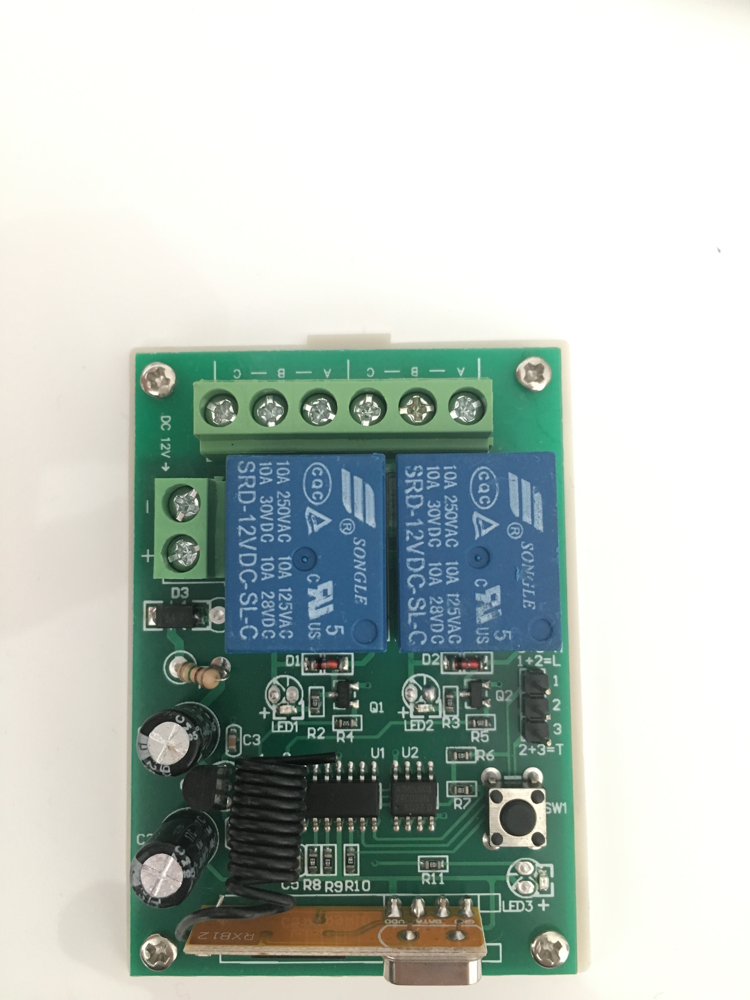

433 Relay boards from eBay, Banggood etc.

The specific 433MHz board I'm working with is called "SYN470R". If you look at the photo, it's the one mounted vertically with a spiral antenna.

Note that my relay board didn't look exactly as the one I ordered, but seems to be very similar in its functions. Physical connections will be documented later.

Adds support for remote controlled relays for motors, toggle/momentary on/off.

If you experience issues please submit the issue at https://github.com/DIYglenn/app.relays.433

Note: 
This is still in development, signals are being decoded and tested.
Will hopefully be able to support multiple of these cheap ($5-10) 433MHz relays.

Based on «nl.brel-motors» app from homey-rfdriver app example.

The following is the change log before initial release.

####v1.3.0
Homey Client version 1.2 and above changed the way signals were received and this resulted in issues with the Brel remote.
This update fixes these issues and signals from the remote should now be able to be received correctly.
Also the option to reset the blinds from Homey is disabled, now you will only be able to pair your motors using your remote. 
This is because some build-in motors should not be reset and this caused usability problems for those users.

####v1.1.0
Added logging and error reporting

####v1.0.1
Increased amount of command repetitions from 5 to 20 to improve reception of the command

####v1.0.0
Initial app release. App is tested with the Brel MLE25-1.1. 

